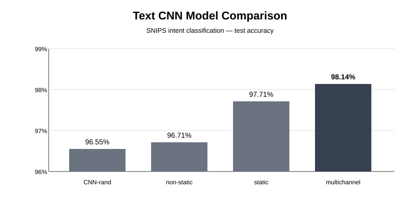

# Intent Classification with Text CNN

Text CNN experiments for **7-class intent classification on the SNIPS dataset**, comparing different word-embedding strategies under the same CNN architecture.

[Portfolio](https://incredible-march-0ef.notion.site/Intent-Classification-with-Text-CNN-3e968564df5a81f4b4b6c0442662376c)

## Project Overview

The goal of this project was to examine how the choice of word-embedding strategy affects intent-classification performance. Four variants were evaluated: randomly initialized embeddings, frozen pretrained embeddings, trainable pretrained embeddings, and a combined frozen/trainable embedding variant.

## Embedding Strategies

| Variant | Initialization | Embedding updates |
| --- | --- | --- |
| CNN-rand | Random | Trainable |
| CNN-static | Pretrained Word2Vec | Frozen |
| CNN-non-static | Pretrained Word2Vec | Trainable |
| CNN-multichannel | Two pretrained tables | One frozen, one trainable; outputs averaged |

Training builds a vocabulary from the training text, converts sentences to token indices, and pads sequences for convolution. Validation accuracy selects the best checkpoint; a separate evaluation script loads that checkpoint and scores the test split.

## Model

The classifier uses convolution filters with window sizes **3, 4, and 5**, with **100 filters per size**, followed by ReLU, max-over-time pooling, dropout, and a fully connected classification layer.

Pretrained variants use **300-dimensional Word2Vec embeddings**. The experiment used Adam with a learning rate of `0.001`, dropout of `0.5`, L2 regularization of `1e-4`, and a batch size of `64`.

> **Implementation note:** In the submitted code, the `multichannel` variant creates a frozen and a trainable embedding table, averages the two embedding outputs, and then feeds the result into a shared CNN feature extractor. Therefore, it is described here according to the actual implementation rather than as a conventional two-channel CNN with separate convolution paths.

## Results

| Model | Test Accuracy |
|---|---:|
| CNN-rand | 96.55% |
| CNN-non-static | 96.71% |
| CNN-static | 97.71% |
| CNN-multichannel | **98.14%** |



The combined frozen/trainable embedding variant achieved the highest recorded test accuracy in the submitted evaluation report, **1.59 percentage points** above CNN-rand. These are historical assignment results; the models have not been retrained in this documentation update.

## Project Structure

```text
intent-classification-textcnn/
├── config/
│   └── text_cnn_snips.yaml
├── data/
│   └── README.md
├── models/
│   └── sentence_cnn.py
├── results/
│   └── model_comparison.svg
├── scripts/
│   ├── train_cnn.py
│   ├── eval_cnn.py
│   └── infer_cnn.py
├── utils/
│   └── text_prepro.py
├── .gitignore
├── README.md
└── requirements.txt
```

## Run

From the repository root:

```bash
pip install -r requirements.txt
python -m scripts.train_cnn --config config/text_cnn_snips.yaml
python -m scripts.eval_cnn --config config/text_cnn_snips.yaml
python -m scripts.infer_cnn "play some music" --config config/text_cnn_snips.yaml
```

The inference text is an example command, not a reported prediction. Module invocation keeps the repository root available for imports.

Prepare the SNIPS train/validation/test files and, for pretrained variants, the Word2Vec binary at the paths specified in [data/README.md](data/README.md). Set `model_type` in the YAML to `rand`, `static`, `non-static`, or `multichannel` before training and evaluating the corresponding variant.

Artifacts are saved under `runs/<model_type>/checkpoints/`:

- `best.pth` — checkpoint selected by validation accuracy
- `vocab.pkl` and `labels.pkl` — token and class mappings
- `embeddings.pkl` — embedding matrix, or `None` for CNN-rand

## Limitations & Review

This experiment compares freezing, fine-tuning, and combining embeddings under one CNN feature extractor. The multichannel implementation averages embedding outputs; its result should be interpreted according to that architecture.

The reported comparison does not include repeated-run uncertainty or training-cost measurements. The random variant also hardcodes a 30,000-entry, 300-dimensional embedding table; changing vocabulary or embedding settings requires checking that token indices remain in range. Dependency versions are not pinned, and the original data and checkpoints are not bundled.

The project provided experience with vocabulary construction, pretrained embedding integration, validation-based checkpoint selection, and separate test evaluation. Future work could add repeated seeds, per-intent error analysis, and comparisons with other sentence encoders.

## Notes

The SNIPS dataset and Google News Word2Vec binary used during the original experiment are not included in this repository. Local machine-specific paths from the coursework submission were removed for portfolio use. See `data/README.md` for the expected directory structure.
